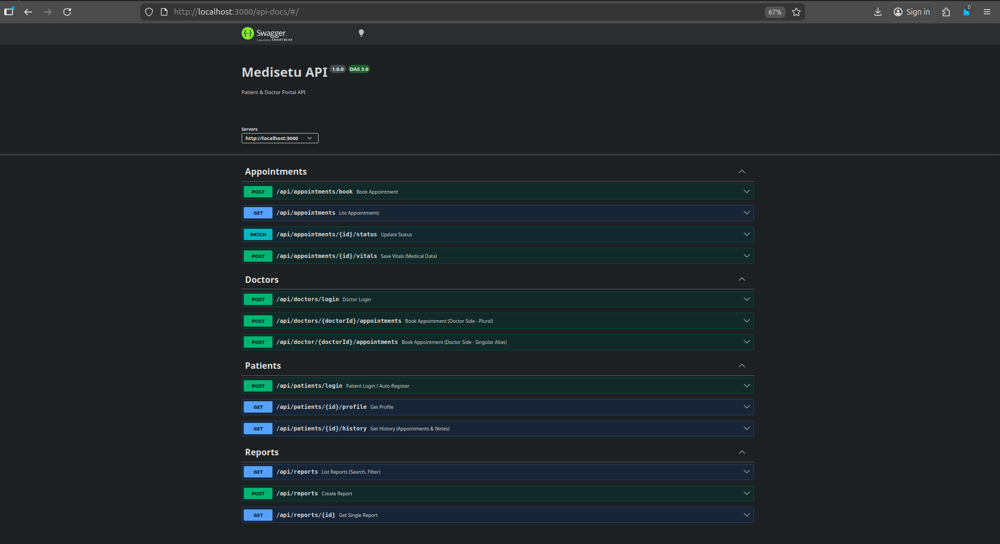

# Medisetu Backend

A robust backend service for the Medisetu Patient & Doctor App, built with Node.js, Express, and MongoDB.

## 🚀 Features

*   **Patient Portal**: Login (Auto-Register), Profile, History, Notes, and Reports.
*   **Doctor Portal**: Login (Auto-Register), Appointment Management, and Patient History.
*   **Appointment System**: Booking with Conflict Detection (409 checks), Status Updates.
*   **Medical Records**: Store vitals, notes, and file-based reports.
*   **Documentation**: Integrated Swagger UI.

---


## 🛠️ Setup & Installation

### Prerequisites
*   Node.js (v14+)
*   MongoDB (Local or Atlas URL)

### Implementation
1.  **Clone the repository**:
    ```bash
    git clone <repository-url>
    cd medisetu-backend
    ```

2.  **Install dependencies**:
    ```bash
    npm install
    ```

3.  **Environment Configuration**:
    Create a `.env` file in the root directory:
    ```env
    PORT=3000
    MONGO_URI=mongodb://localhost:27017/medisetu
    ```

4.  **Start the Server**:
    *   Development (with Nodemon):
        ```bash
        npm run dev
        ```
    *   Production:
        ```bash
        npm start
        ```

---

## 🧪 Testing Endpoints

### 1. Automated Verification
We have included a script to verify the entire flow (Login -> Book -> Vitals -> Reports -> Notes).
```bash
npm run verify
```

### 2. Swagger Documentation
Interactive API documentation is available at:
**[http://localhost:3000/api-docs](http://localhost:3000/api-docs)**

### 3. Key Endpoints Overview

#### **Patients** (`/api/patients`)
*   `POST /login`: Login or Auto-Register using `phoneNumber`.
*   `GET /:id/profile`: Get basic profile.
*   `GET /:id/history`: Get appointment history.
*   `POST /:id/notes`: Create a note with vitals (New Requirement).
*   `GET /:id/notes`: Get note history (Pagination/Sort).

#### **Doctors** (`/api/doctors`)
*   `POST /login`: Login or Auto-Register using `email` or `doctorId`.
*   `POST /:doctorId/appointments`: Book appointment (Doctor-side, handles patient auto-creation).

#### **Appointments** (`/api/appointments`)
*   `POST /book`: General booking endpoint.
*   `PATCH /:id/status`: Update status (e.g., 'Completed').
*   `POST /:id/vitals`: Save medical data (BP, Pulse, Temp) to the appointment.

#### **Reports** (`/api/reports`)
*   `GET /`: Global search with filters (`?q=blood`, `?status=Normal`, `?sort=date_desc`).
*   `POST /`: Create a report (Simulation).

---

## 🧠 Design Decisions & Assumptions

1.  **Auto-Registration**:
    *   To simplify the user flow, both Patient and Doctor login endpoints (`POST /login`) automatically create a new user record if the identifier (`phoneNumber` or `email`) does not exist.

2.  **Strict Routing**:
    *   The API primarily uses Plural routes (e.g., `/api/patients`).
    *   **Exception**: To support specific client requirements, we aliased `/api/doctor` to `/api/doctors` for the appointment booking route, allowing both `POST /api/doctors/:id/appointments` and `POST /api/doctor/:id/appointments`.

3.  **Conflict Handling**:
    *   Appointment booking logic strictly enforces **One Slot Per Doctor**.
    *   Duplicate bookings for the same `doctorId`, `date`, and `slot` return `409 Conflict`.

4.  **Medical Data Storage**:
    *   **Appointment Vitals**: Vitals specific to a visit are stored directly in the `Appointment` document (`POST /api/appointments/:id/vitals`).
    *   **Patient Notes**: General patient notes are stored in a separate `Note` collection (`POST /api/patients/:id/notes`) to maintain a long-term history independent of specific appointments.

5.  **Reports**:
    *   Reports are treated as global entities searchable via metadata (Title, Status). A simulation endpoint allows creating reports with simulated file URLs.
